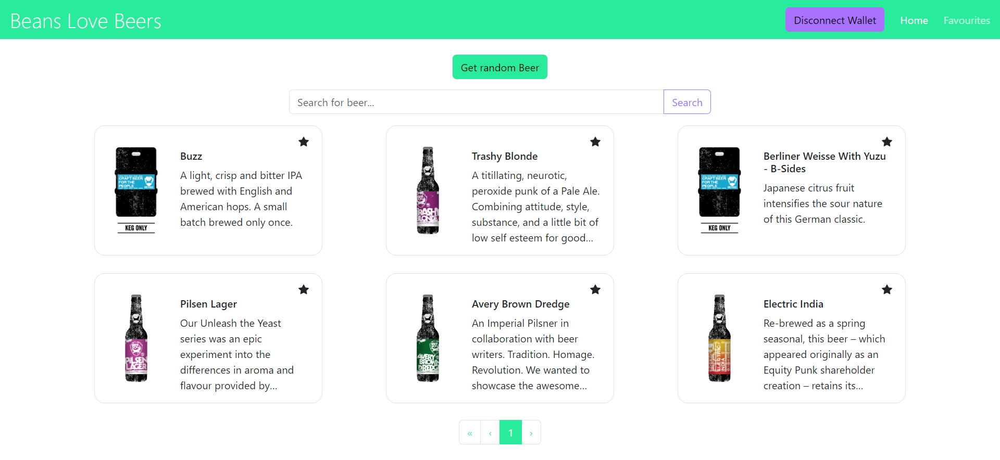

# Beans Love Beers | Punk Beers Application

This template provides a minimal setup to get React working in Vite with HMR and some ESLint rules.

## Description

A React application that makes use of the [punk api](https://punkapi.com/).\
The application supports server-side pagination as well as searching for your favourite beer.\
To use the application, you should first connect your wallet via MetaMask.\
Once you connect it, you will be able to find beers that you like and star them to mark as favourites.\
You can check your saved beers on the Favourites page. There you will see if your beer has been changed by the API.\
If you cannot find a beer that you like, you can use the 'Get random Beer' button to get a random beer.

## How to run?

1. Install the dependencies: `npm install`
2. To run the application in `dev` mode, execute: `npm run dev`
3. Open `http://localhost:5173/`
4. To build a production version execute: `npm run build`
